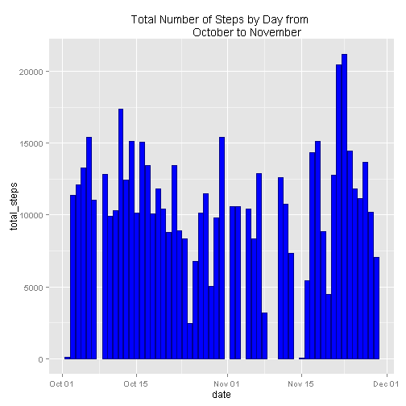
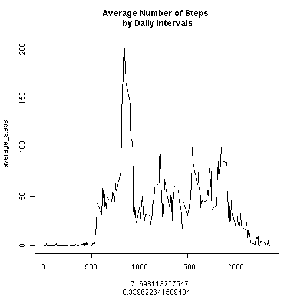
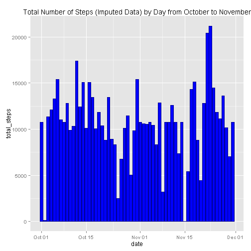
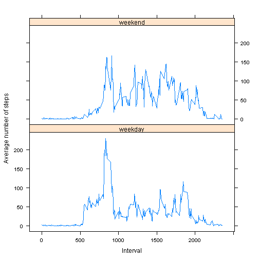

[//]: Example of a RMarkdown comment.  This will not be included in the final document

##Background  

This report has been generated as part of the John's Hopkins Coursera session "Reproducible Research" and is the first peer assignment.  The objective is to demonstrate the capacity to generate RMarkdown documents using the data file **activity.csv**.   This file contains activity data collected through personal activity monitoring devices which collects data every five minutes throughout the day.  The entire data set encompasses two months of data collection (October to November 2012) for an individual.  Each data point represents the number of steps taken within a 5 minute interval. 

##Data Description

The variables included in this dataset are:  

[//]: Example of unordered list

- steps: Number of steps taking in a 5-minute interval (missing values are coded as NA)
- date: The date on which the measurement was taken in YYYY-MM-DD format
- interval: Identifier for the 5-minute interval in which measurement was taken

The dataset is stored in a comma-separated-value (CSV) file and there are a total of 17,568 observations in this dataset


```r
library(dplyr)
library(ggplot2)
library(knitr)
library(lattice)
options(scipen=5)           #prevent the use of scientific notation
```

###Loading and preprocessing the data


```r
#Working DirectorY:
# setwd("C:/Users/conlchri9061/Documents/Coursera/Reproducible Research/ReproRes_Project1/")

activity <- read.csv("activity.csv", 
                     header=TRUE)

activity$date <- as.Date(activity$date, "%Y-%m-%d")
```


### What is mean total number of steps taken per day?

```r
#Using dplyr to group and summarise

Daily_steps_summary <- activity %>%
        group_by(date) %>%
        summarise(total_steps = sum(steps))
```

###Total Number of steps taken per day (histogram)


```r
#If this was for a final report I'd clean up the labels

ggplot(Daily_steps_summary, aes(x = date,
                                y =total_steps)) + 
        geom_histogram(fill = "blue", colour = "darkblue", stat="identity") +
        ggtitle("Total Number of Steps by Day from 
                October to November")
```

```
## Warning: Removed 8 rows containing missing values (position_stack).
```

 

The **mean** number of steps taken each day is *10766.1886792*.

The **median** number of steps taken each day is *10765*.

##Average Daily Activity Pattern


```r
Interval_average <- activity %>%                #Using activity data
        filter(!is.na(steps)) %>%               #Remove NA THEN
        group_by(interval) %>%                  #Group by Interval THEN
        summarise(average_steps= mean(steps))   #Calculate Mean steps
              
plot(Interval_average, 
     Interval_average$average_steps,
     type="l", 
     main="Average Number of Steps \n by Daily Intervals") 
```

 

```r
#I prefer the approach below but I left the approach above 
#to meet the project requirements

#ggplot(Interval_average, 
#       aes(x = interval, 
#           y = average_steps)) + 
#        geom_line(stat="identity") + 
#        labs(title = "Average Number of Steps \n By Daily Intervals", 
#             x = "Intervals", y = "Steps")
```

The interval with the **maximum** number of steps is *835*  with an average of *206.1698113* steps.

##Imputing Missing Values
There are *2304* records with **missing data**.

The interval averages were used rather than the daily averages since there are some days where there were no steps taken and would introduce additional Null values.  A new dataframe was created by:

- joining the original table with the interval averages.

- substituting the interval averages when the steps variable is null

- reducing the new dataframe to the original variables


```r
New_activity <- activity %>%                     #join interval averages
                left_join (Interval_average)
```

```
## Joining by: "interval"
```

```r
New_activity$steps[is.na(New_activity$steps)] <- #sub in avg when null
        New_activity$average_steps
```

```
## Warning in New_activity$steps[is.na(New_activity$steps)] <- New_activity
## $average_steps: number of items to replace is not a multiple of replacement
## length
```

```r
New_activity <- select(New_activity,            #reduce to original variables
                       steps,
                       date,
                       interval)
```


There are 17568 records and 3 variables in both the activity.csv file and the newly created New_activity.csv 


```r
str(activity)
```

```
## 'data.frame':	17568 obs. of  3 variables:
##  $ steps   : int  NA NA NA NA NA NA NA NA NA NA ...
##  $ date    : Date, format: "2012-10-01" "2012-10-01" ...
##  $ interval: int  0 5 10 15 20 25 30 35 40 45 ...
```

```r
str(New_activity)
```

```
## 'data.frame':	17568 obs. of  3 variables:
##  $ steps   : num  1.717 0.3396 0.1321 0.1509 0.0755 ...
##  $ date    : Date, format: "2012-10-01" "2012-10-01" ...
##  $ interval: int  0 5 10 15 20 25 30 35 40 45 ...
```


```r
#Using dplyr to group and summarise

Imputed_Daily_steps_summary <- New_activity %>%
        group_by(date) %>%
        summarise(total_steps = sum(steps))

ggplot(Imputed_Daily_steps_summary, aes(x = date,
                                y =total_steps)) + 
        geom_histogram(fill = "blue", colour = "darkblue", stat="identity") +
        ggtitle("Total Number of Steps (Imputed Data) by Day from October to November")
```

 

The **mean** number of steps taken each day is *10766.1886792*.  The difference between the mean of the imputed data set and the original data set is 0

The **median** number of steps taken each day is *10766.1886792*.  The difference between the imputed data set and the original data set is 1.1886792

The imputation method had **no impact on the mean** and **increased the median** value.

##Are there differences in activity patterns between weekdays and weekends?


```r
New_activity$daytype <- weekdays(as.Date(New_activity$date))

New_activity$weekend <- ifelse(New_activity$daytype 
                               %in% c("Saturday",
                                      "Sunday"), 
                               "weekend", "weekday" )
```


```r
#summarise data

Interval_average_weekday <- New_activity %>%         #Using New_activity data
        group_by(interval, weekend) %>%              #Group by Interval and day type THEN
        summarise(average_steps= mean(steps))        #Calculate Mean steps

xyplot(average_steps ~ interval | weekend, 
        Interval_average_weekday, 
        type = "l", 
        layout = c(1, 2), 
        xlab = "Interval", 
       ylab = "Average number of steps")
```

 

There does appear to be differences in activity between weekdays and weekends:  

- **less** activity during the early morning intervals on the weekend than on the weekday.

- **more** activity during the midday intervals on the weekend than on the weekdays
